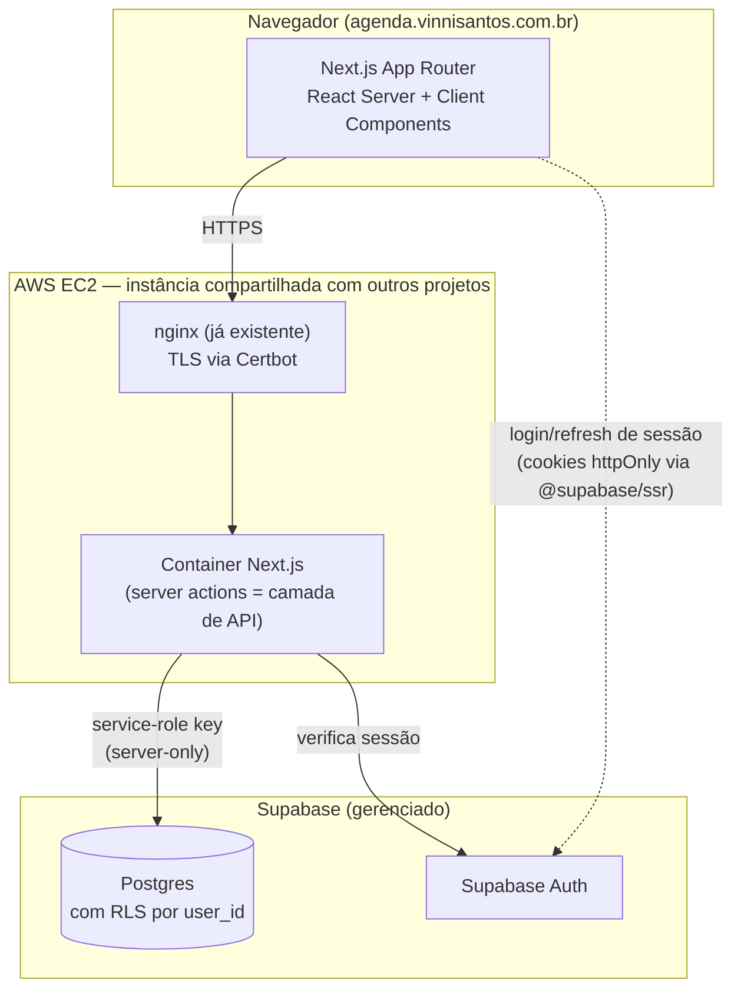
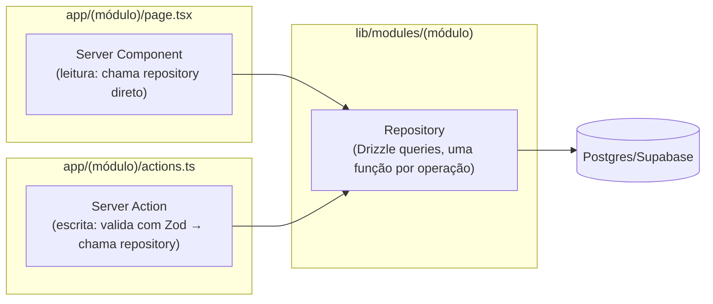

# Arquitetura

## Stack

| Camada | Escolha | Motivo (resumo — detalhes em `adr/`) |
|---|---|---|
| Frontend + Backend | **Next.js 15** (App Router, TypeScript, Server Components + Server Actions) | Um único deployable, um único runtime, menos superfície de ataque para um app de usuário único. Ver [ADR-0002](adr/0002-nextjs-como-backend.md). |
| Banco de dados | **Supabase Postgres** (obrigatório) | Postgres gerenciado, RLS nativo, Auth integrado. |
| Autenticação | **Supabase Auth** (e-mail/senha, sign-up desabilitado) | Ver [ADR-0003](adr/0003-autenticacao-supabase.md). |
| ORM / migrations | **Drizzle ORM** + `drizzle-kit` | Queries tipadas ponta a ponta, migrations versionadas como SQL, sem magia de ORM pesado. |
| Validação | **Zod** | Única fonte de verdade de schema em cada boundary (formulário → server action → banco). |
| UI | **Tailwind CSS v4 + shadcn/ui (Radix)** | Acessível por padrão (Radix), tokens de design fáceis de portar do site atual. Ver [`05-design-system.md`](05-design-system.md). |
| Infra | **Docker** atrás do **nginx** já existente em **AWS EC2** (instância compartilhada) | Ver [ADR-0004](adr/0004-nginx-compartilhado-em-vez-de-caddy.md) — nginx + Certbot já são a convenção da instância, não Caddy dedicado. |
| CI | **GitHub Actions** | Lint + typecheck + testes + build de imagem em cada PR. |

Stack **não** usada, e por quê: sem backend C#/.NET separado (documentado no
ADR-0002 — não é proibido, mas desnecessário: adicionaria um segundo runtime, um
segundo deploy e uma segunda superfície de auth para um domínio de app que não
exige processamento pesado). Sem microsserviços — é um app pessoal, um monólito
bem dividido em módulos é mais fácil de manter sozinho.

## Visão de componentes



## Por que Next.js "é" o backend

Não existe uma API REST/GraphQL separada. A camada de acesso a dados vive dentro
do próprio Next.js, em três fatias:



Regra fixa: **nenhum Client Component fala com o banco diretamente**. Toda leitura
passa por Server Component (ou Route Handler quando precisa ser chamado via
`fetch`/polling do cliente); toda escrita passa por Server Action. Isso mantém a
`SUPABASE_SERVICE_ROLE_KEY` inteiramente fora do bundle do navegador.

## Estrutura de pastas (alvo, para quando a implementação começar)

```
app-vinnicius/
├── src/
│   ├── app/
│   │   ├── (auth)/login/
│   │   ├── (dashboard)/
│   │   │   ├── page.tsx                 # Dashboard
│   │   │   ├── financeiro/
│   │   │   ├── treinos/
│   │   │   ├── alimentacao/
│   │   │   └── estudos-trabalhos/
│   │   └── layout.tsx
│   ├── lib/
│   │   ├── supabase/                    # clients (server/browser/middleware)
│   │   ├── db/                          # drizzle schema + client
│   │   └── modules/
│   │       ├── financeiro/{repository,actions,schema}.ts
│   │       ├── treinos/...
│   │       ├── alimentacao/...
│   │       └── kanban/...
│   ├── components/
│   │   ├── ui/                          # shadcn/ui primitives
│   │   └── (módulo)/                    # composições específicas de módulo
│   └── proxy.ts                         # redireciona não-autenticado -> /login
│                                         # (renomeado de middleware.ts no Next.js 16)
├── supabase/
│   └── migrations/                      # SQL versionado (fonte de verdade do schema)
├── docs/
├── Dockerfile
├── docker-compose.yml                   # build/teste local e deploy no servidor
└── .dockerignore
```

Cada módulo (`financeiro`, `treinos`, `alimentacao`, `kanban`) é uma fatia vertical
independente: schema Zod, repository Drizzle e server actions próprios. Nenhum
módulo importa o repository de outro — se o Dashboard precisa de dados de vários
módulos, ele importa a função pública de cada um (`getTodayCards()`,
`getTodayWorkout()`, etc.), nunca a tabela crua de outro módulo.

## Ambientes

| Ambiente | Onde | Banco |
|---|---|---|
| Local | máquina do Vinnicius, `next dev` | Projeto Supabase de desenvolvimento (gratuito) |
| Produção | EC2, container Docker | Projeto Supabase de produção |

Sem ambiente de "staging" dedicado na v1 — app de usuário único, o risco de pular
staging é aceitável e documentado como trade-off consciente.
