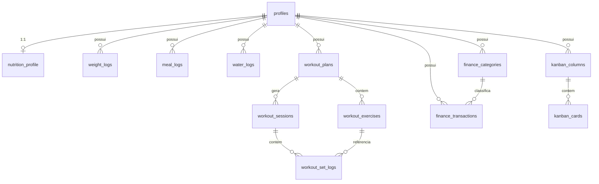

# Modelo de Dados

Postgres via Supabase. Todas as tabelas de domínio (exceto `auth.users`, gerenciada
pelo Supabase Auth) seguem o mesmo contrato de isolamento por usuário:

```sql
user_id uuid not null default auth.uid() references auth.users(id) on delete cascade
```

com **Row Level Security habilitada e a mesma policy em todas**:

```sql
alter table <tabela> enable row level security;

create policy "owner_full_access" on <tabela>
  for all
  using (auth.uid() = user_id)
  with check (auth.uid() = user_id);
```

Isso é decidido mesmo para um app de usuário único: é a garantia de que um bug de
aplicação (ex.: um `WHERE` esquecido) nunca vaza dado entre contas, e deixa o
schema pronto caso um segundo usuário (ex.: esposa/parceiro) precise de conta
própria no futuro sem redesenho. Ver [`06-seguranca.md`](06-seguranca.md).

Convenções: chaves primárias `uuid default gen_random_uuid()`; timestamps
`timestamptz`; toda tabela mutável tem `created_at` e `updated_at` (via trigger
`set_updated_at`); enums de domínio são `check` constraints em texto (mais simples
de migrar que `enum` nativo do Postgres).

---

## Diagrama geral



---

## `profiles`

Estende `auth.users` com dados de perfil. Criada automaticamente via trigger no
`auth.users` (`on_auth_user_created`).

| Coluna | Tipo | Notas |
|---|---|---|
| `id` | `uuid` PK | = `auth.users.id` |
| `full_name` | `text` | |
| `avatar_url` | `text` | nullable |
| `timezone` | `text` | default `'America/Sao_Paulo'` |
| `created_at` / `updated_at` | `timestamptz` | |

---

## Módulo Alimentação

### `nutrition_profile` (1 linha por usuário — configurações do cálculo de TDEE)

| Coluna | Tipo | Notas |
|---|---|---|
| `user_id` | `uuid` PK/FK | |
| `sex` | `text` | check in `('M','F')` |
| `birth_date` | `date` | |
| `height_cm` | `numeric(5,1)` | |
| `activity_level` | `text` | check in `('sedentario','leve','moderado','ativo','muito_ativo')` |
| `formula` | `text` | default `'mifflin_st_jeor'` |
| `calorie_goal` | `numeric(6,1)` | default `2500` — meta fixa pedida |
| `water_goal_ml` | `integer` | default `3000` |
| `updated_at` | `timestamptz` | |

BMR/TDEE **não são armazenados** — são derivados em tempo real (peso mais recente
de `weight_logs` + `nutrition_profile`), evitando dado calculado ficar
dessincronizado do peso atual. Fórmula documentada em
[`04-api-contratos.md`](04-api-contratos.md#alimentação).

### `weight_logs`

| Coluna | Tipo | Notas |
|---|---|---|
| `id` | `uuid` PK | |
| `user_id` | `uuid` FK | |
| `logged_at` | `date` | unique por `(user_id, logged_at)` |
| `weight_kg` | `numeric(5,2)` | |

### `meal_logs` (checklist de refeições)

| Coluna | Tipo | Notas |
|---|---|---|
| `id` | `uuid` PK | |
| `user_id` | `uuid` FK | |
| `log_date` | `date` | |
| `meal_slot` | `text` | check in `('cafe_da_manha','almoco','lanche','jantar','ceia')` |
| `description` | `text` | nullable |
| `calories` | `numeric(6,1)` | nullable — usuário pode marcar feito sem detalhar calorias |
| `is_completed` | `boolean` | default `false` |
| `completed_at` | `timestamptz` | nullable |

Unique `(user_id, log_date, meal_slot)` — um registro por refeição por dia.

### `water_logs`

| Coluna | Tipo | Notas |
|---|---|---|
| `id` | `uuid` PK | |
| `user_id` | `uuid` FK | |
| `log_date` | `date` | |
| `amount_ml` | `integer` | incremento (várias linhas por dia, soma = total do dia) |
| `logged_at` | `timestamptz` | default `now()` |

---

## Módulo Treinos (calistenia, divisão AB)

### `workout_plans`

| Coluna | Tipo | Notas |
|---|---|---|
| `id` | `uuid` PK | |
| `user_id` | `uuid` FK | |
| `name` | `text` | ex. "Calistenia AB" |
| `is_active` | `boolean` | default `true` — só um plano ativo por vez na UI |

### `workout_exercises`

| Coluna | Tipo | Notas |
|---|---|---|
| `id` | `uuid` PK | |
| `plan_id` | `uuid` FK → `workout_plans` | |
| `day_label` | `text` | check in `('A','B')` |
| `name` | `text` | ex. "Barra fixa pronada" |
| `target_sets` | `smallint` | |
| `target_reps` | `text` | texto livre (ex. "8-12" ou "AMRAP") |
| `order_index` | `smallint` | ordem de exibição no treino |

### `workout_sessions` (uma execução do treino A ou B em um dia)

| Coluna | Tipo | Notas |
|---|---|---|
| `id` | `uuid` PK | |
| `user_id` | `uuid` FK | |
| `plan_id` | `uuid` FK | |
| `day_label` | `text` | check in `('A','B')` |
| `performed_at` | `date` | |
| `notes` | `text` | nullable |

### `workout_set_logs`

| Coluna | Tipo | Notas |
|---|---|---|
| `id` | `uuid` PK | |
| `session_id` | `uuid` FK → `workout_sessions` | on delete cascade |
| `exercise_id` | `uuid` FK → `workout_exercises` | |
| `set_number` | `smallint` | |
| `reps_done` | `smallint` | |
| `weight_kg` | `numeric(5,2)` | nullable (peso corporal = null) |

---

## Módulo Financeiro

### `finance_categories`

| Coluna | Tipo | Notas |
|---|---|---|
| `id` | `uuid` PK | |
| `user_id` | `uuid` FK | |
| `name` | `text` | ex. "Combustível", "Mercado", "Faculdade" |
| `kind` | `text` | check in `('receita','despesa')` |
| `color` | `text` | hex, para UI |

Seed inicial (via migration, não hardcoded no app): categorias de despesa comuns
(Moradia, Mercado, Transporte, Faculdade, Lazer, Saúde) e receita
(Estágio, Corridas de App, Outros).

### `finance_transactions`

| Coluna | Tipo | Notas |
|---|---|---|
| `id` | `uuid` PK | |
| `user_id` | `uuid` FK | |
| `category_id` | `uuid` FK → `finance_categories` | nullable |
| `type` | `text` | check in `('receita_fixa','receita_variavel','despesa')` |
| `description` | `text` | |
| `amount` | `numeric(10,2)` | sempre positivo; sinal vem de `type` |
| `occurred_on` | `date` | data do fluxo de caixa |
| `is_recurring` | `boolean` | default `false` — ex. bolsa de estágio mensal |
| `created_at` | `timestamptz` | |

`type` mapeia direto os três fluxos pedidos: renda fixa do estágio
(`receita_fixa`), renda variável de corridas (`receita_variavel`) e despesas
mensais (`despesa`). Saldo do mês = agregação em memória/consulta, não coluna
derivada.

---

## Módulo Estudos e Trabalhos (Kanban)

### `kanban_columns`

| Coluna | Tipo | Notas |
|---|---|---|
| `id` | `uuid` PK | |
| `user_id` | `uuid` FK | |
| `name` | `text` | ex. "A Fazer", "Fazendo", "Feito" |
| `order_index` | `smallint` | |

Seed inicial por usuário (via trigger em `profiles` insert, mesmo padrão do
Financeiro): 3 colunas padrão, editáveis depois.

### `kanban_cards`

| Coluna | Tipo | Notas |
|---|---|---|
| `id` | `uuid` PK | |
| `user_id` | `uuid` FK | |
| `column_id` | `uuid` FK → `kanban_columns` | |
| `title` | `text` | |
| `description` | `text` | nullable |
| `category` | `text` | check in `('faculdade','estagio','projeto_pessoal')` |
| `priority` | `text` | check in `('baixa','media','alta')`, default `'media'` |
| `due_date` | `date` | nullable — usado pelo Dashboard para "hoje/atrasado" |
| `order_index` | `smallint` | posição dentro da coluna |
| `completed_at` | `timestamptz` | nullable |

---

## Dashboard — sem tabelas próprias

O Dashboard não persiste dado novo: é uma composição, no Server Component, de
consultas "hoje" de cada módulo:

- `kanban_cards` com `due_date <= hoje` e não concluído → "pendências do dia".
- `workout_sessions` de hoje (existe? qual `day_label` era esperado, A ou B, por
  alternância desde a última sessão).
- `meal_logs`/`water_logs` de hoje → progresso de refeições e água.
- Atalho de lançamento rápido para `finance_transactions`.

Ver contratos exatos em [`04-api-contratos.md`](04-api-contratos.md#dashboard).

## Índices

Todo `FK` recebe índice (Postgres não cria automaticamente). Adicionalmente:
`(user_id, log_date)` em `meal_logs`/`water_logs`, `(user_id, occurred_on)` em
`finance_transactions`, `(user_id, due_date)` em `kanban_cards` — são os padrões
de consulta do Dashboard e das telas de histórico.
