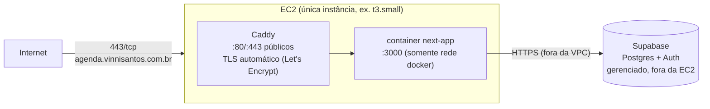
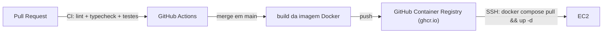

# Infraestrutura e Deploy

## Topologia

Uma única instância EC2 roda dois containers via `docker compose`: Caddy
(proxy/TLS) e o app Next.js. Supabase é externo e gerenciado — não roda na EC2.

## DNS

- Registro `A` (ou `CNAME`, conforme o provedor de DNS já usado por
  `vinnisantos.com.br`) para `agenda.vinnisantos.com.br` apontando para o IP
  elástico da instância EC2.
- IP **elástico** (Elastic IP), não o IP público dinâmico da instância — evita
  ter que atualizar o DNS a cada reinício/troca de instância.

## Container

`Dockerfile` multi-stage:
1. `deps` — instala dependências (`npm ci`).
2. `builder` — `next build` com `output: 'standalone'` (bundle mínimo, sem
   precisar do `node_modules` completo em produção).
3. `runner` — imagem final `node:20-alpine`, roda como usuário não-root,
   copia só o output standalone + estáticos.

`docker-compose.yml` na instância define os dois serviços (`app`, `caddy`),
uma rede interna compartilhada, e monta:
- `Caddyfile` (config do proxy — bloco único para o domínio, `reverse_proxy
  app:3000`).
- Volume nomeado para `caddy_data` (persistência do certificado TLS entre
  restarts).
- `.env.production` injetado via `env_file` (nunca via `ARG`/`ENV` no
  Dockerfile, para não vazar segredo na imagem).

## Pipeline de deploy

- CI (GitHub Actions) roda em todo PR: `lint`, `typecheck`, testes,
  `drizzle-kit check` (detecta migration pendente não commitada).
- Merge em `main` builda e publica a imagem no GHCR, tag `latest` + SHA do
  commit.
- Deploy é acionado por um step de CI que conecta via SSH (chave dedicada,
  restrita a esse único comando) e roda `docker compose pull && docker compose
  up -d` na instância — sem downtime perceptível (restart de container único,
  aceitável para app pessoal; sem necessidade de blue-green).
- Migrations do Drizzle rodam como step **manual, antes** do deploy da nova
  imagem quando há mudança de schema — nunca automático no boot do container,
  para nunca rodar uma migration destrutiva sem revisão.

## Provisionamento da instância (uma vez)

1. EC2 `t3.small` (ou menor — app pessoal, tráfego baixo), Ubuntu LTS.
2. Security Group: só `22` (SSH, restrito ao IP do Vinnicius ou via chave),
   `80` e `443` públicos. Nenhuma outra porta exposta.
3. Docker + Docker Compose instalados.
4. Usuário não-root dedicado ao deploy, chave SSH própria (não a chave
   pessoal de admin da AWS).
5. `ufw` (firewall do SO) espelhando o Security Group como segunda camada.

## Observabilidade

- Logs do container via `docker compose logs` / driver `json-file` com
  `max-size` limitado (evita disco cheio na instância pequena).
- Sem stack de observabilidade dedicada na v1 (sem Grafana/Prometheus) — escopo
  desproporcional para um app de usuário único. Revisitar se o app crescer
  para uso de mais pessoas.
