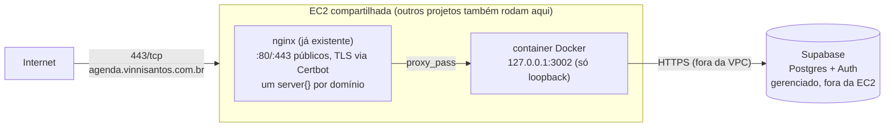
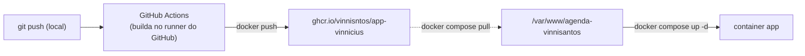

# Infraestrutura e Deploy

> Revisado após inspecionar a instância real (ver [ADR-0004](adr/0004-nginx-compartilhado-em-vez-de-caddy.md)):
> a EC2 já é compartilhada por outros projetos, com nginx + certbot como
> convenção estabelecida. O plano abaixo substitui a v1 (Caddy dedicado).

## Topologia

O Life OS é **mais um site** nessa instância, não dono dela. Convenção já em uso
por outros projetos (`governanca.vinnisantos.com.br` é o exemplo mais próximo,
outro app Next.js) e replicada aqui:

- Código em `/var/www/agenda-vinnisantos` (`git clone` do repo público).
- Container roda só em `127.0.0.1:<porta>` — nunca `0.0.0.0` — só o nginx do
  host precisa alcançá-lo.
- Um arquivo em `/etc/nginx/sites-available/<nome>`, symlink em `sites-enabled/`.
- Certificado via `certbot --nginx -d <domínio>` (reaproveita a conta já
  registrada no Certbot desse servidor).

**Porta atribuída ao Life OS: `3002`** (portas já em uso por outros projetos no
momento do deploy: `3000`, `3001`, `5000` — dotnet/Next.js de outros clientes —
e `8080` — container `marcai-app`). Antes de reutilizar esta porta no futuro,
confirme com `ss -tlnp` que continua livre.

## DNS

- `agenda.vinnisantos.com.br` já resolve para o IP público da instância
  (confirmado antes do primeiro deploy) — nenhuma ação de DNS pendente.

## Container

`Dockerfile` multi-stage (`deps` → `builder` com `next build`, `output:
'standalone'` em `next.config.ts` → `runner` `node:24-alpine`, usuário
não-root, só copia `.next/standalone` + `.next/static` + `public/`).

`docker-compose.yml` sobe um serviço único (`app`), publica em
`127.0.0.1:3002:3000`, injeta segredos via `env_file: .env.production` (nunca
`ARG`/`ENV` no Dockerfile — não vaza no `docker history`).

## Deploy — build sempre fora da EC2

> **Incidente de 2026-09-07:** um `docker compose build` rodado direto na EC2
> (trocando a imagem base para `node:24-alpine`, sem cache) esgotou a memória
> da instância — ela tem só ~900 MB de RAM, compartilhados com os outros
> projetos hospedados ali. A instância parou de responder por completo
> (nginx, SSM, todos os sites — inclusive de outros projetos) por mais de 30
> minutos, só recuperando após `aws ec2 reboot-instances`. **Build nunca mais
> roda na EC2** — só `docker compose pull` (baixar uma imagem já pronta), que
> não builda nada e usa memória mínima.

- `.github/workflows/build-and-push.yml` builda a imagem a cada push em
  `main` (runner do GitHub, memória de sobra) e publica em
  `ghcr.io/vinnisntos/app-vinnicius:latest` — pacote público (sem
  autenticação necessária para `docker pull` no servidor).
- Deploy continua manual via SSM Session Manager, mas agora só:
  `cd /var/www/agenda-vinnisantos && git pull && docker compose pull &&
  docker compose up -d` — nenhum desses comandos builda nada.
- `git pull` no servidor é só para manter `docker-compose.yml`/`Dockerfile`/
  migrations em sincronia com o repositório — o código da aplicação em si
  vem inteiramente da imagem publicada, não do checkout local.
- `.env.production` vive só no servidor (nunca commitado), com as mesmas
  chaves de `.env.example`.
- Migrations do Drizzle continuam manuais (via MCP/`psql`/Supabase Studio),
  nunca automáticas no boot do container — mesma regra da v1.
- **Próxima melhoria natural, não implementada ainda:** disparar o `git pull
  && docker compose pull && docker compose up -d` automaticamente via SSM a
  partir do próprio workflow do GitHub Actions, assim que a imagem terminar
  de publicar (hoje esse último passo ainda é manual).

## Acesso à instância

- Acesso via **AWS SSM Session Manager** (`aws ssm start-session --target
  <instance-id>`), não SSH direto — não depende de chave exposta nem de porta
  22 aberta para o IP de quem está deployando.
- Sessão abre como `root` (papel da instância já configurado assim pelo
  ambiente existente) — cuidado redobrado com qualquer comando que afete
  `/etc/nginx` ou containers de outros projetos na mesma máquina.

## Conexão com o banco (pooler)

`DATABASE_URL` **deve** usar o pooler de transação do Supabase (porta
`6543`), nunca o de sessão (porta `5432`) — o de sessão tem teto de 15
conexões simultâneas por projeto e já causou uma indisponibilidade real do
Dashboard quando uma página passou a fazer várias queries em paralelo. Ver
[ADR-0006](adr/0006-pooler-transacao-em-vez-de-sessao.md) para o incidente
completo e por que o código (`prepare: false` em `src/lib/db/client.ts`) já
esperava esse modo.

## Observabilidade

- Logs do container via `docker compose logs` / `docker logs`.
- Sem stack de observabilidade dedicada — escopo desproporcional para um app
  de usuário único, e a instância já não tem uma para os outros projetos
  hospedados nela.
